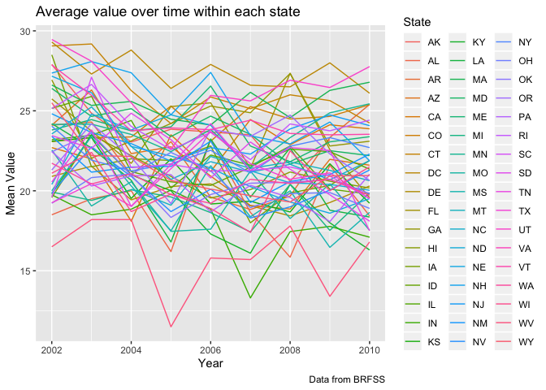
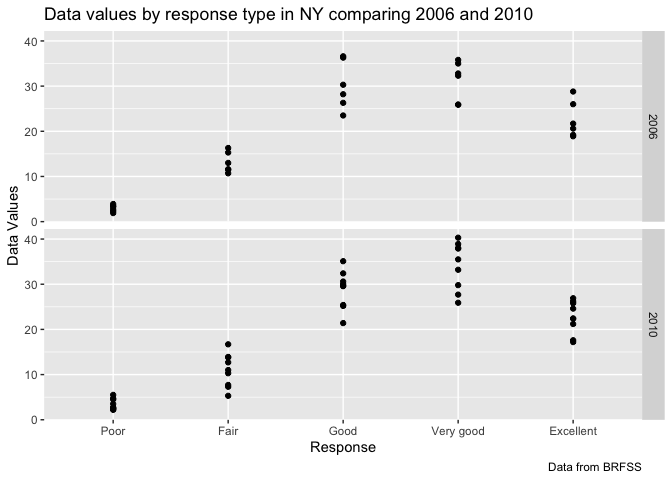

p8105\_hw3\_rac2224
================
Rachel Crowley
10/13/2019

## Problem 1

``` r
library(tidyverse)
```

    ## ── Attaching packages ─────────────────────────────────────────────────────────────────────────────────────────────── tidyverse 1.2.1.9000 ──

    ## ✔ ggplot2 3.2.1          ✔ purrr   0.3.2     
    ## ✔ tibble  2.1.3          ✔ dplyr   0.8.3     
    ## ✔ tidyr   1.0.0.9000     ✔ stringr 1.4.0     
    ## ✔ readr   1.3.1          ✔ forcats 0.4.0

    ## ── Conflicts ─────────────────────────────────────────────────────────────────────────────────────────────────────── tidyverse_conflicts() ──
    ## ✖ dplyr::filter() masks stats::filter()
    ## ✖ dplyr::lag()    masks stats::lag()

``` r
library(knitr)
library(p8105.datasets)

data("instacart")
```

Describing the Dataset “instacart”

Dataset size and structure

  - The number of observations in the dataset instacart is 1384617. The
    number of columns in the dataset instacart is 15. The variables in
    the dataset instacart are order\_id, product\_id,
    add\_to\_cart\_order, reordered, user\_id, eval\_set, order\_number,
    order\_dow, order\_hour\_of\_day, days\_since\_prior\_order,
    product\_name, aisle\_id, department\_id, aisle, department. The
    dimensions of the dataset instacart are 1384617, 15.
  - The structure of the variables within the dataset instacart are as
    follows: order\_id is an integer, product\_id is an integer,
    add\_to\_cart\_order is an integer, reordered is an integer,
    user\_id is an integer, eval\_set is a character, order\_number is
    an integer, order\_dow is an integer, order\_hour\_of\_day is an
    integer, days\_since\_prior\_order is an integer, product\_name is a
    character, aisle\_id is an integer, department\_id is an integer,
    aisle is a character, and department is a character.

Key variable description

  - The min, max, mean, and median of each of the integer variables are
    as follows: for order\_ID, the minimum is 1, the maximum is 3421070,
    the mean is 1.706297610^{6}, and the median is 1701880; for
    product\_ID, the minimum is 1, the maximum is 49688, the mean is
    2.555623610^{4}, and the median is 25298; for add\_to\_cart\_order,
    the minimum is 1, the maximum is 80, the mean is 8.7580443, and the
    median is 7; for reordered, the minimum is 0, the maximum is 1, the
    mean is 0.5985944, and the median is 1; for user\_id, the minimum is
    1, the maximum is 206209, the mean is 1.031127810^{5}, and the
    median is 102933; for order\_number, the minimum is 4, the maximum
    is 100, the mean is 17.0914101, and the median is 11; for
    order\_dow, the minimum is 0, the maximum is 6, the mean is
    2.7013918, and the median is 3; for order\_hour\_of\_day, the
    minimum is 0, the maximum is 23, the mean is 13.5775922, and the
    median is 14; for days\_since\_prior\_order, the minimum is 0, the
    maximum is 30, the mean is 17.0661259, and the median is 15; for
    aisle\_id, the minimum is 1, the maximum is 134, the mean is
    71.30423, and the median is 83; and for department\_id, the minimum
    is 1, the maximum is 21, the mean is 9.8397774, and the median is 8.
  - The number of missing observations for each variable are as follows:
    for order\_id is 0, for product\_id is 0, for add\_to\_cart\_order
    is 0, for reordered is 0, for user\_id is 0, for eval\_set is 0, for
    order\_number is 0, for order\_dow is 0, for order\_hour\_of\_day is
    0, for days\_since\_prior\_order is 0, for product\_name is 0, for
    aisle\_id is 0, for department\_id is 0, for aisle is 0, and for
    department is 0.

Examples of observations

  - The mean order hour of day for products from the produce department
    is 13.5597245, the mean order hour of day for products from the
    frozen department is 13.8093223, and the mean order hour of day for
    products from the household department is 13.447813. The largest
    number of days since prior order for an order that included
    something from the eggs aisle is 30 and for an order that included
    something from the coffee aisle is 30.

Number of aisles and aisles with most items ordered

``` r
instacart %>%
  count(aisle, n_distinct = n_distinct(aisle))%>%
  arrange(desc(n)) 
```

    ## # A tibble: 134 x 3
    ##    aisle                         n_distinct      n
    ##    <chr>                              <int>  <int>
    ##  1 fresh vegetables                     134 150609
    ##  2 fresh fruits                         134 150473
    ##  3 packaged vegetables fruits           134  78493
    ##  4 yogurt                               134  55240
    ##  5 packaged cheese                      134  41699
    ##  6 water seltzer sparkling water        134  36617
    ##  7 milk                                 134  32644
    ##  8 chips pretzels                       134  31269
    ##  9 soy lactosefree                      134  26240
    ## 10 bread                                134  23635
    ## # … with 124 more rows

  - There 134 unique aisles in the dataset “instacart”. The aisles with
    most items ordered include the “fresh vegetables” aisle with 150609
    orders, “fresh fruits” aisle with 150473 orders, the “packaged
    vegetables fruits” aisle with 78493 orders, the “yogurt” aisle with
    55240 orders, and the “packaged cheese” aisle with 41699 orders.

Plot for number of items ordered in each aisle

``` r
instacart %>%
  count(aisle, n_distinct = n_distinct(aisle))%>%
  arrange(desc(n)) %>%
  filter(n >= 10000) %>%
    mutate(aisle = forcats::fct_reorder(aisle, n)) %>%
  ggplot(aes(x=aisle, y=(n))) + geom_point() + theme(axis.text.x = element_text(angle = 45, vjust = 1, hjust=1)) +
    labs(
      title = "Number of orders per aisle for aisles with 10,000 orders or more",
      x = "Aisle",
      y = "Number of orders",
      caption = "Data from Instacart"
    )
```

<!-- -->

  - Based on the plot created above, the aisles with most items ordered
    include the “fresh vegetables”, “fresh fruits”, “packaged vegetables
    fruits”, “yogurt” and “packaged cheese” aisles, which supports
    previous conclusions made regarding the aisles with most items
    ordered. Fresh vegetables has the most items ordered, and butter has
    the least items ordered. The number of orders for the majority of
    aisles presented stays below 40,000, until there is a sharp and
    almost exponential increase in the number of orders seen for the
    aisles “fresh vegetables”, “fresh fruits”, “packaged vegetavles
    fruits”, “yogurt” and “packaged cheese”.

Table showing the three most popular items in aisles “baking
ingredients”, “dog food care”, and “packaged vegetables
fruits”

``` r
instacart2 = instacart[which(instacart$aisle=='baking ingredients' | instacart$aisle == 'dog food care'| instacart$aisle == 'packaged vegetables fruits'), 1:15]
instacart3 = instacart[which(instacart$product_name=='Light Brown Sugar' | instacart$product_name=='Pure Baking Soda' | instacart$product_name=='Cane Sugar'| instacart$product_name=='Snack Sticks Chicken & Rice Recipe Dog Treats' | instacart$product_name=='Organix Chicken & Brown Rice Recipe' | instacart$product_name=='Small Dog Biscuits' | instacart$product_name=='Organic Baby Spinach' | instacart$product_name=='Organic Raspberries' | instacart$product_name=='Organic Blueberries'),1:15] 
instacart3 %>%
  group_by(aisle, product_name) %>%
  summarize(
    n_order = n()
  ) %>%
  arrange(desc(n_order)) %>%
  knitr::kable(caption = "Number of orders for top three ordered products in the 'packaged vegetables fruits', 'baking ingredients' and 'dog good care' aisles")
```

| aisle                      | product\_name                                 | n\_order |
| :------------------------- | :-------------------------------------------- | -------: |
| packaged vegetables fruits | Organic Baby Spinach                          |     9784 |
| packaged vegetables fruits | Organic Raspberries                           |     5546 |
| packaged vegetables fruits | Organic Blueberries                           |     4966 |
| baking ingredients         | Light Brown Sugar                             |      499 |
| baking ingredients         | Pure Baking Soda                              |      387 |
| baking ingredients         | Cane Sugar                                    |      336 |
| dog food care              | Snack Sticks Chicken & Rice Recipe Dog Treats |       30 |
| dog food care              | Organix Chicken & Brown Rice Recipe           |       28 |
| dog food care              | Small Dog Biscuits                            |       26 |

Number of orders for top three ordered products in the ‘packaged
vegetables fruits’, ‘baking ingredients’ and ‘dog good care’ aisles

  - The three most popular items in each aisle are as follows: for
    baking ingredients the items are Light Brown Sugar (n=499), Pure
    Baking Soda (n=387), and Cane Sugar (n=336); for dog food care the
    items are Snack Sticks Chicken & Rice Recipe Dog Treats (n=26),
    Organix Chicken & Brown Rice Recipe (n=28), and Small Dog Biscuits
    (n=26); for packaged vegetables fruits the items are Organic Baby
    Spinach (n=9784), Organic Raspberries (n=5546), Organic Blueberries
    (n=4966).

Table showing the mean hour of the day at which Pink Lady Apples and
Coffee Ice Cream are ordered on each day of the
week

``` r
instacart4 = instacart[which(instacart$product_name=='Pink Lady Apples' | instacart$product_name == 'Coffee Ice Cream'), 1:15] %>%
 select(product_name, order_dow, order_hour_of_day)%>%
 group_by(order_dow, product_name) %>%
 summarize(mean_hour= mean(order_hour_of_day)) %>%
  pivot_wider(
    names_from = "order_dow",
    values_from = "mean_hour"
  )
colnames(instacart4)[colnames(instacart4)=="0"] <- "Sunday"
colnames(instacart4)[colnames(instacart4)=="1"] <- "Monday"
colnames(instacart4)[colnames(instacart4)=="2"] <- "Tuesday"
colnames(instacart4)[colnames(instacart4)=="3"] <- "Wednesday"
colnames(instacart4)[colnames(instacart4)=="4"] <- "Thursday"
colnames(instacart4)[colnames(instacart4)=="5"] <- "Friday"
colnames(instacart4)[colnames(instacart4)=="6"] <- "Saturday"
colnames(instacart4)[colnames(instacart4)=="product_name"] <- "Product Name"
instacart4 %>%
knitr::kable(caption = "Mean hour of day for order by product name and day of week" )
```

| Product Name     |   Sunday |   Monday |  Tuesday | Wednesday | Thursday |   Friday | Saturday |
| :--------------- | -------: | -------: | -------: | --------: | -------: | -------: | -------: |
| Coffee Ice Cream | 13.77419 | 14.31579 | 15.38095 |  15.31818 | 15.21739 | 12.26316 | 13.83333 |
| Pink Lady Apples | 13.44118 | 11.36000 | 11.70213 |  14.25000 | 11.55172 | 12.78431 | 11.93750 |

Mean hour of day for order by product name and day of week

  - For pink lady apples, the highest mean hour of day for an order is
    on Wednesday with a mean of 14.25 hours and the lowest mean hour of
    day for an order is on Monday with a mean of 11.36 hours. For coffee
    ice cream, the highest mean hour of day for an order is on Tuesday
    with a mean of 15.38 and the lowest mean hour of day for an order is
    on Friday with a mean of 12.26.

## Problem 2

Data cleaning

``` r
data("brfss_smart2010") 
brfss_smart2010 = janitor::clean_names(brfss_smart2010) 
brfss_smart2010 = brfss_smart2010[which(brfss_smart2010$topic=='Overall Health'| brfss_smart2010$response =='Poor'| brfss_smart2010$response =='Fair'|brfss_smart2010$response =='Good' | brfss_smart2010$response =='Very good' | brfss_smart2010$response =='Excellent'), 1:23] 
response = as.factor(pull(brfss_smart2010, response))
response <- factor(response, levels = c("Poor", "Fair", "Good", "Very good", "Excellent"), ordered = TRUE)
levels(response)
```

    ## [1] "Poor"      "Fair"      "Good"      "Very good" "Excellent"

In 2002, which states were observed at 7 or more
locations?

``` r
brfss_smart2002 = brfss_smart2010[which(brfss_smart2010$year=='2002'), 1:23] %>%
  group_by(locationabbr) %>%
count(locationdesc, n_distinct = n_distinct(locationdesc))%>%
  arrange(desc(locationdesc)) %>%
   filter(n_distinct >= 7) %>%
  knitr::kable(Caption = "States observed at 7 or more locations in 2002")
brfss_smart2002
```

| locationabbr | locationdesc             | n\_distinct | n |
| :----------- | :----------------------- | ----------: | -: |
| PA           | PA - Westmoreland County |          10 | 5 |
| PA           | PA - Philadelphia County |          10 | 5 |
| PA           | PA - Montgomery County   |          10 | 5 |
| PA           | PA - Lancaster County    |          10 | 5 |
| PA           | PA - Franklin County     |          10 | 5 |
| PA           | PA - Delaware County     |          10 | 5 |
| PA           | PA - Chester County      |          10 | 5 |
| PA           | PA - Bucks County        |          10 | 5 |
| PA           | PA - Armstrong County    |          10 | 5 |
| PA           | PA - Allegheny County    |          10 | 5 |
| NJ           | NJ - Union County        |           8 | 5 |
| NJ           | NJ - Somerset County     |           8 | 5 |
| NJ           | NJ - Morris County       |           8 | 5 |
| NJ           | NJ - Monmouth County     |           8 | 5 |
| NJ           | NJ - Middlesex County    |           8 | 5 |
| NJ           | NJ - Hudson County       |           8 | 5 |
| NJ           | NJ - Essex County        |           8 | 5 |
| NJ           | NJ - Bergen County       |           8 | 5 |
| NC           | NC - Randolph County     |           7 | 5 |
| NC           | NC - Orange County       |           7 | 5 |
| NC           | NC - Mecklenburg County  |           7 | 5 |
| NC           | NC - Henderson County    |           7 | 5 |
| NC           | NC - Guilford County     |           7 | 5 |
| NC           | NC - Forsyth County      |           7 | 5 |
| NC           | NC - Buncombe County     |           7 | 5 |
| MA           | MA - Worcester County    |           8 | 5 |
| MA           | MA - Suffolk County      |           8 | 5 |
| MA           | MA - Plymouth County     |           8 | 5 |
| MA           | MA - Norfolk County      |           8 | 5 |
| MA           | MA - Middlesex County    |           8 | 5 |
| MA           | MA - Hampden County      |           8 | 5 |
| MA           | MA - Essex County        |           8 | 5 |
| MA           | MA - Bristol County      |           8 | 5 |
| FL           | FL - Pinellas County     |           7 | 5 |
| FL           | FL - Palm Beach County   |           7 | 5 |
| FL           | FL - Orange County       |           7 | 5 |
| FL           | FL - Miami-Dade County   |           7 | 5 |
| FL           | FL - Hillsborough County |           7 | 5 |
| FL           | FL - Duval County        |           7 | 5 |
| FL           | FL - Broward County      |           7 | 5 |
| CT           | CT - Windham County      |           7 | 5 |
| CT           | CT - Tolland County      |           7 | 5 |
| CT           | CT - New London County   |           7 | 5 |
| CT           | CT - New Haven County    |           7 | 5 |
| CT           | CT - Middlesex County    |           7 | 5 |
| CT           | CT - Hartford County     |           7 | 5 |
| CT           | CT - Fairfield County    |           7 | 5 |

  - In 2002, the following states were observed at 7 or more locations:
    PA, NJ, NC, MA, FL, and CT.

In 2010, which states were obsered at 7 or more
locations?

``` r
brfss_smart2010_2 = brfss_smart2010[which(brfss_smart2010$year=='2010'), 1:23] %>%
  group_by(locationabbr) %>%
count(locationdesc, n_distinct = n_distinct(locationdesc))%>%
  arrange(desc(locationdesc)) %>%
   filter(n_distinct >= 7) %>%
  knitr::kable(Caption = "States observed at 7 or more locations in 2010")
brfss_smart2010_2
```

| locationabbr | locationdesc                | n\_distinct | n |
| :----------- | :-------------------------- | ----------: | -: |
| WA           | WA - Yakima County          |          10 | 5 |
| WA           | WA - Thurston County        |          10 | 5 |
| WA           | WA - Spokane County         |          10 | 5 |
| WA           | WA - Snohomish County       |          10 | 5 |
| WA           | WA - Pierce County          |          10 | 5 |
| WA           | WA - Kitsap County          |          10 | 5 |
| WA           | WA - King County            |          10 | 5 |
| WA           | WA - Franklin County        |          10 | 5 |
| WA           | WA - Clark County           |          10 | 5 |
| WA           | WA - Benton County          |          10 | 5 |
| TX           | TX - Wichita County         |          16 | 5 |
| TX           | TX - Webb County            |          16 | 5 |
| TX           | TX - Val Verde County       |          16 | 5 |
| TX           | TX - Travis County          |          16 | 5 |
| TX           | TX - Tarrant County         |          16 | 5 |
| TX           | TX - Smith County           |          16 | 5 |
| TX           | TX - Randall County         |          16 | 5 |
| TX           | TX - Potter County          |          16 | 5 |
| TX           | TX - Midland County         |          16 | 5 |
| TX           | TX - Lubbock County         |          16 | 5 |
| TX           | TX - Hidalgo County         |          16 | 5 |
| TX           | TX - Harris County          |          16 | 5 |
| TX           | TX - Fort Bend County       |          16 | 5 |
| TX           | TX - El Paso County         |          16 | 5 |
| TX           | TX - Dallas County          |          16 | 5 |
| TX           | TX - Bexar County           |          16 | 5 |
| SC           | SC - Richland County        |           7 | 5 |
| SC           | SC - Horry County           |           7 | 5 |
| SC           | SC - Greenville County      |           7 | 5 |
| SC           | SC - Charleston County      |           7 | 5 |
| SC           | SC - Berkeley County        |           7 | 5 |
| SC           | SC - Beaufort County        |           7 | 5 |
| SC           | SC - Aiken County           |           7 | 5 |
| PA           | PA - Westmoreland County    |           7 | 5 |
| PA           | PA - Philadelphia County    |           7 | 5 |
| PA           | PA - Northampton County     |           7 | 5 |
| PA           | PA - Montgomery County      |           7 | 5 |
| PA           | PA - Luzerne County         |           7 | 5 |
| PA           | PA - Lehigh County          |           7 | 5 |
| PA           | PA - Allegheny County       |           7 | 5 |
| OH           | OH - Summit County          |           8 | 5 |
| OH           | OH - Stark County           |           8 | 5 |
| OH           | OH - Montgomery County      |           8 | 5 |
| OH           | OH - Mahoning County        |           8 | 5 |
| OH           | OH - Lucas County           |           8 | 5 |
| OH           | OH - Hamilton County        |           8 | 5 |
| OH           | OH - Franklin County        |           8 | 5 |
| OH           | OH - Cuyahoga County        |           8 | 5 |
| NY           | NY - Westchester County     |           9 | 5 |
| NY           | NY - Suffolk County         |           9 | 5 |
| NY           | NY - Queens County          |           9 | 5 |
| NY           | NY - New York County        |           9 | 5 |
| NY           | NY - Nassau County          |           9 | 5 |
| NY           | NY - Monroe County          |           9 | 5 |
| NY           | NY - Kings County           |           9 | 5 |
| NY           | NY - Erie County            |           9 | 5 |
| NY           | NY - Bronx County           |           9 | 5 |
| NJ           | NJ - Warren County          |          19 | 5 |
| NJ           | NJ - Union County           |          19 | 5 |
| NJ           | NJ - Sussex County          |          19 | 5 |
| NJ           | NJ - Somerset County        |          19 | 5 |
| NJ           | NJ - Passaic County         |          19 | 5 |
| NJ           | NJ - Ocean County           |          19 | 5 |
| NJ           | NJ - Morris County          |          19 | 5 |
| NJ           | NJ - Monmouth County        |          19 | 5 |
| NJ           | NJ - Middlesex County       |          19 | 5 |
| NJ           | NJ - Mercer County          |          19 | 5 |
| NJ           | NJ - Hunterdon County       |          19 | 5 |
| NJ           | NJ - Hudson County          |          19 | 5 |
| NJ           | NJ - Gloucester County      |          19 | 5 |
| NJ           | NJ - Essex County           |          19 | 5 |
| NJ           | NJ - Cape May County        |          19 | 5 |
| NJ           | NJ - Camden County          |          19 | 5 |
| NJ           | NJ - Burlington County      |          19 | 5 |
| NJ           | NJ - Bergen County          |          19 | 5 |
| NJ           | NJ - Atlantic County        |          19 | 5 |
| NE           | NE - Seward County          |          10 | 5 |
| NE           | NE - Scotts Bluff County    |          10 | 5 |
| NE           | NE - Sarpy County           |          10 | 5 |
| NE           | NE - Madison County         |          10 | 5 |
| NE           | NE - Lincoln County         |          10 | 5 |
| NE           | NE - Lancaster County       |          10 | 5 |
| NE           | NE - Hall County            |          10 | 5 |
| NE           | NE - Douglas County         |          10 | 5 |
| NE           | NE - Dakota County          |          10 | 5 |
| NE           | NE - Adams County           |          10 | 5 |
| NC           | NC - Wake County            |          12 | 5 |
| NC           | NC - Union County           |          12 | 5 |
| NC           | NC - Randolph County        |          12 | 5 |
| NC           | NC - Orange County          |          12 | 5 |
| NC           | NC - Mecklenburg County     |          12 | 5 |
| NC           | NC - Johnston County        |          12 | 5 |
| NC           | NC - Guilford County        |          12 | 5 |
| NC           | NC - Gaston County          |          12 | 5 |
| NC           | NC - Durham County          |          12 | 5 |
| NC           | NC - Catawba County         |          12 | 5 |
| NC           | NC - Cabarrus County        |          12 | 5 |
| NC           | NC - Buncombe County        |          12 | 5 |
| MD           | MD - Washington County      |          12 | 5 |
| MD           | MD - Queen Anne’s County    |          12 | 5 |
| MD           | MD - Prince George’s County |          12 | 5 |
| MD           | MD - Montgomery County      |          12 | 5 |
| MD           | MD - Howard County          |          12 | 5 |
| MD           | MD - Harford County         |          12 | 5 |
| MD           | MD - Frederick County       |          12 | 5 |
| MD           | MD - Charles County         |          12 | 5 |
| MD           | MD - Cecil County           |          12 | 5 |
| MD           | MD - Baltimore County       |          12 | 5 |
| MD           | MD - Baltimore city         |          12 | 5 |
| MD           | MD - Anne Arundel County    |          12 | 5 |
| MA           | MA - Worcester County       |           9 | 5 |
| MA           | MA - Suffolk County         |           9 | 5 |
| MA           | MA - Plymouth County        |           9 | 5 |
| MA           | MA - Norfolk County         |           9 | 5 |
| MA           | MA - Middlesex County       |           9 | 5 |
| MA           | MA - Hampshire County       |           9 | 5 |
| MA           | MA - Hampden County         |           9 | 5 |
| MA           | MA - Essex County           |           9 | 5 |
| MA           | MA - Bristol County         |           9 | 5 |
| FL           | FL - Wakulla County         |          41 | 5 |
| FL           | FL - Volusia County         |          41 | 5 |
| FL           | FL - St. Lucie County       |          41 | 5 |
| FL           | FL - St. Johns County       |          41 | 5 |
| FL           | FL - Seminole County        |          41 | 5 |
| FL           | FL - Sarasota County        |          41 | 5 |
| FL           | FL - Santa Rosa County      |          41 | 5 |
| FL           | FL - Polk County            |          41 | 5 |
| FL           | FL - Pinellas County        |          41 | 5 |
| FL           | FL - Pasco County           |          41 | 5 |
| FL           | FL - Palm Beach County      |          41 | 5 |
| FL           | FL - Osceola County         |          41 | 5 |
| FL           | FL - Orange County          |          41 | 5 |
| FL           | FL - Nassau County          |          41 | 5 |
| FL           | FL - Monroe County          |          41 | 5 |
| FL           | FL - Miami-Dade County      |          41 | 5 |
| FL           | FL - Martin County          |          41 | 5 |
| FL           | FL - Marion County          |          41 | 5 |
| FL           | FL - Manatee County         |          41 | 5 |
| FL           | FL - Leon County            |          41 | 5 |
| FL           | FL - Lee County             |          41 | 5 |
| FL           | FL - Lake County            |          41 | 5 |
| FL           | FL - Jefferson County       |          41 | 5 |
| FL           | FL - Hillsborough County    |          41 | 5 |
| FL           | FL - Highlands County       |          41 | 5 |
| FL           | FL - Hernando County        |          41 | 5 |
| FL           | FL - Hardee County          |          41 | 5 |
| FL           | FL - Gilchrist County       |          41 | 5 |
| FL           | FL - Gadsden County         |          41 | 5 |
| FL           | FL - Escambia County        |          41 | 5 |
| FL           | FL - Duval County           |          41 | 5 |
| FL           | FL - DeSoto County          |          41 | 5 |
| FL           | FL - Columbia County        |          41 | 5 |
| FL           | FL - Collier County         |          41 | 5 |
| FL           | FL - Clay County            |          41 | 5 |
| FL           | FL - Citrus County          |          41 | 5 |
| FL           | FL - Broward County         |          41 | 5 |
| FL           | FL - Brevard County         |          41 | 5 |
| FL           | FL - Bay County             |          41 | 5 |
| FL           | FL - Baker County           |          41 | 5 |
| FL           | FL - Alachua County         |          41 | 5 |
| CO           | CO - Larimer County         |           7 | 5 |
| CO           | CO - Jefferson County       |           7 | 5 |
| CO           | CO - El Paso County         |           7 | 5 |
| CO           | CO - Douglas County         |           7 | 5 |
| CO           | CO - Denver County          |           7 | 5 |
| CO           | CO - Arapahoe County        |           7 | 5 |
| CO           | CO - Adams County           |           7 | 5 |
| CA           | CA - Santa Clara County     |          12 | 5 |
| CA           | CA - San Mateo County       |          12 | 5 |
| CA           | CA - San Francisco County   |          12 | 5 |
| CA           | CA - San Diego County       |          12 | 5 |
| CA           | CA - San Bernardino County  |          12 | 5 |
| CA           | CA - Sacramento County      |          12 | 5 |
| CA           | CA - Riverside County       |          12 | 5 |
| CA           | CA - Placer County          |          12 | 5 |
| CA           | CA - Orange County          |          12 | 5 |
| CA           | CA - Los Angeles County     |          12 | 5 |
| CA           | CA - Contra Costa County    |          12 | 5 |
| CA           | CA - Alameda County         |          12 | 5 |

  - In 2010, the following states were observed at 7 or more locations:
    WA, TX, SC, PA, OH , NY, NJ, NE, NC, MD, MA, FL, CO, CA.

Dataset limited to excellent responses, averaging data\_value across
locations

``` r
brfss_excellent = brfss_smart2010[which(brfss_smart2010$response=='Excellent'), 1:23] %>%
   select(year, locationabbr, data_value) %>% 
  group_by(locationabbr, year) %>%
  summarize(mean_value = mean(data_value, na.rm = TRUE)) 
ggplot(data = brfss_excellent, aes(x = year, y = mean_value, group = locationabbr, color = locationabbr)) + geom_line() +
  labs(
      title = "Average value over time within each state",
      x = "Year",
      y = "Mean Value",
      caption = "Data from BRFSS"
    ) + 
   scale_color_hue(name = "State")
```

<!-- -->

  - Based of the spaghetti plot made above showing the average value
    over time within each state, the mean value fluctuates differently
    over time depending on the state, with great variation between
    states when comparing the same year, as well as great variation
    within a state when comparing across years.

Making a two-panel
plot

``` r
brfss_panel = brfss_smart2010[which(brfss_smart2010$locationabbr=='NY'), 1:23] 
brfss_panel$response <- factor(brfss_panel$response,levels = c("Poor", "Fair", "Good", "Very good", "Excellent"))
brfss_panel = brfss_panel[which(brfss_panel$year=='2006' | brfss_panel$year =='2010'), 1:23] 
  panel1 = 
    brfss_panel %>% 
    ggplot(aes(x = response, y = data_value)) +
    geom_point() +
    labs(
      title = "Data values by response type in NY comparing 2006 and 2010",
      x = "Response",
      y = "Data Values",
      caption = "Data from BRFSS"
    )
  panel1 + facet_grid(rows = vars(year))
```

<!-- -->

  - For both 2006 and 2010 in NY, the smallest data values are
    distributed among the poor response category and the data values
    increase going from poor to fair, and from fair to good; however, in
    2006, the data values distributed among the very good category
    appear to slightly decrease in comparison to the good category, and
    decreases even more from very good to excellent. In contrast, in
    2010, the data values continue to slightly increase from the good to
    very good category, and the values distributed among the excellent
    variable are lower in value in comparison to the very good category.
    The distribution of data values for the poor response is the
    smallest for both 2006 and 2010, whereas the distribution of data
    values is wider for all other response categories in 2006 and 2010.
    In 2006, the distribution of data values for response categories
    good, very good, and excellent overlap. Similarly, in 2010, the
    distribution of data values for response categories good, very good,
    and excellent overlap, as well as slightly for the distribution of
    data values for response categories fair and excellent.

## Problem 3

Load, tidy, and wrangle accel\_data

``` r
accel_data = read_csv(file = "./data/accel_data.csv") 
```

    ## Parsed with column specification:
    ## cols(
    ##   .default = col_double(),
    ##   day = col_character()
    ## )

    ## See spec(...) for full column specifications.

``` r
accel_data = janitor::clean_names(accel_data) 
day = as.factor(pull(accel_data, day))
day <- factor(day, levels = c("Monday", "Tuesday", "Wednesday", "Thursday", "Friday", "Saturday", "Sunday"), ordered = TRUE)
levels(day)
```

    ## [1] "Monday"    "Tuesday"   "Wednesday" "Thursday"  "Friday"    "Saturday" 
    ## [7] "Sunday"

``` r
accel_data %>%
  mutate(
    weekend_v_weekday = case_when(
      day < 6 ~ "weekday",
      day >= 6 ~ "weekend",
      TRUE      ~ ""
    ))
```

    ## # A tibble: 35 x 1,444
    ##     week day_id day   activity_1 activity_2 activity_3 activity_4
    ##    <dbl>  <dbl> <chr>      <dbl>      <dbl>      <dbl>      <dbl>
    ##  1     1      1 Frid…       88.4       82.2       64.4       70.0
    ##  2     1      2 Mond…        1          1          1          1  
    ##  3     1      3 Satu…        1          1          1          1  
    ##  4     1      4 Sund…        1          1          1          1  
    ##  5     1      5 Thur…       47.4       48.8       46.9       35.8
    ##  6     1      6 Tues…       64.8       59.5       73.7       45.7
    ##  7     1      7 Wedn…       71.1      103.        68.5       45.4
    ##  8     2      8 Frid…      675        542       1010        779  
    ##  9     2      9 Mond…      291        335        393        335  
    ## 10     2     10 Satu…       64         11          1          1  
    ## # … with 25 more rows, and 1,437 more variables: activity_5 <dbl>,
    ## #   activity_6 <dbl>, activity_7 <dbl>, activity_8 <dbl>,
    ## #   activity_9 <dbl>, activity_10 <dbl>, activity_11 <dbl>,
    ## #   activity_12 <dbl>, activity_13 <dbl>, activity_14 <dbl>,
    ## #   activity_15 <dbl>, activity_16 <dbl>, activity_17 <dbl>,
    ## #   activity_18 <dbl>, activity_19 <dbl>, activity_20 <dbl>,
    ## #   activity_21 <dbl>, activity_22 <dbl>, activity_23 <dbl>,
    ## #   activity_24 <dbl>, activity_25 <dbl>, activity_26 <dbl>,
    ## #   activity_27 <dbl>, activity_28 <dbl>, activity_29 <dbl>,
    ## #   activity_30 <dbl>, activity_31 <dbl>, activity_32 <dbl>,
    ## #   activity_33 <dbl>, activity_34 <dbl>, activity_35 <dbl>,
    ## #   activity_36 <dbl>, activity_37 <dbl>, activity_38 <dbl>,
    ## #   activity_39 <dbl>, activity_40 <dbl>, activity_41 <dbl>,
    ## #   activity_42 <dbl>, activity_43 <dbl>, activity_44 <dbl>,
    ## #   activity_45 <dbl>, activity_46 <dbl>, activity_47 <dbl>,
    ## #   activity_48 <dbl>, activity_49 <dbl>, activity_50 <dbl>,
    ## #   activity_51 <dbl>, activity_52 <dbl>, activity_53 <dbl>,
    ## #   activity_54 <dbl>, activity_55 <dbl>, activity_56 <dbl>,
    ## #   activity_57 <dbl>, activity_58 <dbl>, activity_59 <dbl>,
    ## #   activity_60 <dbl>, activity_61 <dbl>, activity_62 <dbl>,
    ## #   activity_63 <dbl>, activity_64 <dbl>, activity_65 <dbl>,
    ## #   activity_66 <dbl>, activity_67 <dbl>, activity_68 <dbl>,
    ## #   activity_69 <dbl>, activity_70 <dbl>, activity_71 <dbl>,
    ## #   activity_72 <dbl>, activity_73 <dbl>, activity_74 <dbl>,
    ## #   activity_75 <dbl>, activity_76 <dbl>, activity_77 <dbl>,
    ## #   activity_78 <dbl>, activity_79 <dbl>, activity_80 <dbl>,
    ## #   activity_81 <dbl>, activity_82 <dbl>, activity_83 <dbl>,
    ## #   activity_84 <dbl>, activity_85 <dbl>, activity_86 <dbl>,
    ## #   activity_87 <dbl>, activity_88 <dbl>, activity_89 <dbl>,
    ## #   activity_90 <dbl>, activity_91 <dbl>, activity_92 <dbl>,
    ## #   activity_93 <dbl>, activity_94 <dbl>, activity_95 <dbl>,
    ## #   activity_96 <dbl>, activity_97 <dbl>, activity_98 <dbl>,
    ## #   activity_99 <dbl>, activity_100 <dbl>, activity_101 <dbl>,
    ## #   activity_102 <dbl>, activity_103 <dbl>, activity_104 <dbl>, …

  - The number of observations in the dataset accel\_data is 35. With
    the addition of the weekend\_v\_weekday variable, the number of
    columns in the dataset accel\_data is 1444. The variables in the
    dataset accel\_data are week, day\_ID, day, activity\_1 through
    activity\_1440, and weekend\_v\_weekday. The dimensions of the
    dataset accel\_data are 35, 1444. The number of missing values in
    the dataset accel\_data is 0 since there are 50505 values labeled as
    false for missing.

Table for total activity level per day

``` r
accel_data %>%
  mutate(total_activity = rowSums(.[4:1443])) %>%
  select(day_id, day, total_activity) %>%
  arrange(desc(total_activity)) %>%
  knitr::kable(caption = "Total activity level per day")
```

| day\_id | day       | total\_activity |
| ------: | :-------- | --------------: |
|      16 | Monday    |       685910.00 |
|       4 | Sunday    |       631105.00 |
|      29 | Friday    |       620860.00 |
|      10 | Saturday  |       607175.00 |
|       8 | Friday    |       568839.00 |
|      33 | Thursday  |       549658.00 |
|       1 | Friday    |       480542.62 |
|      12 | Thursday  |       474048.00 |
|      21 | Wednesday |       468869.00 |
|      15 | Friday    |       467420.00 |
|      18 | Sunday    |       467052.00 |
|      35 | Wednesday |       445366.00 |
|      14 | Wednesday |       440962.00 |
|      28 | Wednesday |       434460.00 |
|      13 | Tuesday   |       423245.00 |
|      11 | Sunday    |       422018.00 |
|      23 | Monday    |       409450.00 |
|      30 | Monday    |       389080.00 |
|      17 | Saturday  |       382928.00 |
|      20 | Tuesday   |       381507.00 |
|       3 | Saturday  |       376254.00 |
|      19 | Thursday  |       371230.00 |
|      34 | Tuesday   |       367824.00 |
|       5 | Thursday  |       355923.64 |
|      26 | Thursday  |       340291.00 |
|       7 | Wednesday |       340115.01 |
|      27 | Tuesday   |       319568.00 |
|       6 | Tuesday   |       307094.24 |
|       9 | Monday    |       295431.00 |
|      25 | Sunday    |       260617.00 |
|      22 | Friday    |       154049.00 |
|      32 | Sunday    |       138421.00 |
|       2 | Monday    |        78828.07 |
|      24 | Saturday  |         1440.00 |
|      31 | Saturday  |         1440.00 |

Total activity level per day

  - When looking at the total activity each day for the 35 day study
    period, there appears to be no trends in the level of activity, as
    the highest levels of total activity are from weekdays and weekends
    from the beginning and end of the study period, while the lowest
    levels of activity also include weekdays and weekends from the
    beginning and end of the study period. This data does not show a
    trend in the level of activity by day of week, or day of the study
    period.
